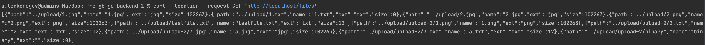
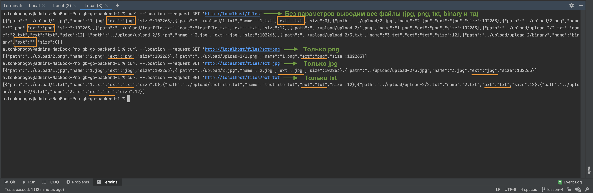

# Lesson 4 Homework

1. Добавить в пример с файловым сервером возможность получить список всех файлов
   на сервере (имя, расширение, размер в байтах)

    - Запустить uploadserver (`go run uploadserver.go`)
    - Перейти в браузере по ссылке: http://localhost/files
    - Или выполнить в консоли:

```shell
 curl --location --request GET 'http://localhost/files'
```


2. С помощью query-параметра, реализовать фильтрацию выводимого списка по
   расширению (то есть, выводить только .png файлы, или только .jpeg)
   
    - Запустить uploadserver (`go run uploadserver.go`)
    - Перейти в браузере по ссылкам:
      - http://localhost/files?ext=txt
      - http://localhost/files?ext=png
      - http://localhost/files?ext=jpg
    - Или выполнить в консоли:
```shell
 curl --location --request GET 'http://localhost/files?ext=txt'
```
```shell
 curl --location --request GET 'http://localhost/files?ext=png'
```
```shell
 curl --location --request GET 'http://localhost/files?ext=jpg'
```


3. *Текущая реализация сервера не позволяет хранить несколько файлов с одинаковым
   названием (т.к. они будут храниться в одной директории на диске). Подумайте, как
   можно обойти это ограничение?
   - Во время сохранения можно проверять на наличие файлов с таким же названием и сохранять с добавлением к названию порядковый номер копии, например,"testfile.txt" превратится в "testfile 1.txt".
4. К коду, написанному в рамках заданий 1-3, добавьте тесты с использованием
   библиотеки httptest.
   - Тесты добавлены