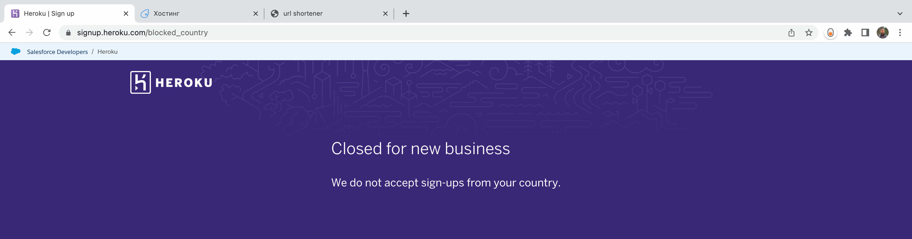
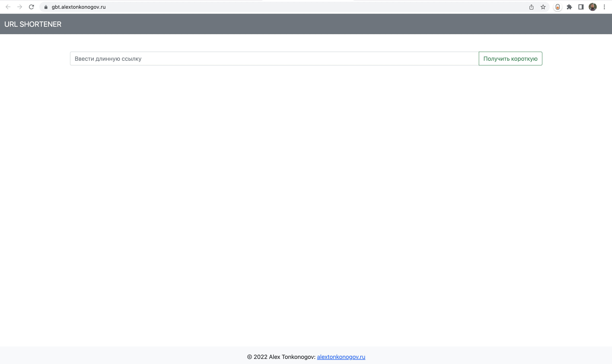

# gb-go-backend-1
## lesson-9
### Task1

_Проверьте наличие реализации процесса непрерывной интеграции для своего курсового проекта. Опишите этапы, из которых состоит этот процесс, например: запуск линтеров, запуск тестов, компиляция приложения, сборка Docker-образа. Есть ли что-то, что вы хотите добавить в этот процесс?_

Есть такое, но не все. Настроены линтеры и прекоммит с компиляцией, также присутствует Docker file и настроен Docker Compose. Нужно будет добавить тестов и настроить CI/CD, однако с последним пока есть проблемы из-за Heroku, который не дает зарегаться российским пользователям.

---
### Task2

_Разверните текущую версию курсового проекта на платформе Heroku. Приложите ссылку на развернутый экземпляр приложения и Pull Request или ссылку на код, описывающий конфигурацию приложения под Heroku. Настройте автоматическое развертывание новой версии приложения по изменениям в главной ветке репозитория._

С Heroku не получилось - не дает зарегистрироваться.

Развернул текущую версию приложения у себя на сайте (платформа NetAngels) - [gbt.alextonkonogov.ru](https://gbt.alextonkonogov.ru/)

Там похожая логика, как в Heroku: БД подключить можно на выбор, воспользоваться переменными окружения или задать свои собственные. Только, к сожалению, не нашел возможности включить прослушку на master и настроить непрерывное развертывание.

Текущая версия проекта полностью работоспособна, но написана она была между первым м третьим занятием данного курса, поэтому пока не выдержана структура проекта, не использован подход гексагональной архитектуры, нет тестов и прочих свистелок. Есть возможность запуститься локально через Docker Compose. Постараюсь привести проект в порядок до 4 июля.

Код текущей версии: https://github.com/alextonkonogov/gb-go-url-shortener 